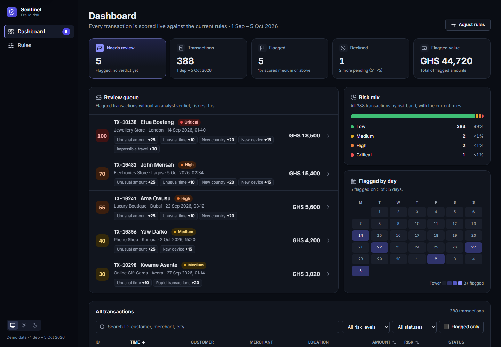

# Sentinel

A fraud-risk dashboard that scores every transaction live against a set of editable rules, and gives analysts a queue of flagged transactions to review.

**Live demo:** https://gid-dadzie.github.io/Sentinel/



> All data is generated. 388 transactions for 10 fictional customers between 1 September and 5 October 2026, with a few suspicious ones planted on purpose. Nothing is sent to a server: rule changes, analyst reviews and the theme choice are saved in your browser.

## What you can do

- **Work the review queue.** The dashboard opens on flagged transactions that have no analyst verdict yet, riskiest first, with the rules that fired on each.
- **Investigate a transaction.** See exactly why it scored what it did, rule by rule, next to the customer's normal behaviour (average amount, known countries and devices) and their recent activity. Record a verdict: confirmed fraud or legitimate.
- **Look at a customer.** Headline numbers, current risk (the average score of their last 5 transactions), flagged transactions, the countries, cities, devices and categories they normally use, and their full history.
- **Tune the rules.** Switch rules on or off and change their points. Every transaction is re-scored immediately, and the page shows how flagged, pending and declined counts change against the defaults.
- **Search, filter and sort** all transactions by risk level, status, country, minimum amount and start date. Filters live in the URL, so a filtered view can be bookmarked or shared.
- Light, dark or system theme. Works on phones.

## How scoring works

Each transaction is checked against six rules, using only that customer's **earlier** transactions as history. The points of every rule that fires are added up and capped at 100.

| Rule               | Fires when                                                                                      | Default points |
| ------------------ | ----------------------------------------------------------------------------------------------- | -------------: |
| Unusual amount     | At least 3 earlier transactions and the amount is above 5× the customer's average               |             25 |
| Unusual time       | Made between 00:00 and 04:59                                                                    |             10 |
| New country        | The customer has history but has never transacted in this country                               |             20 |
| New device         | The customer has history but has never used this device                                         |             15 |
| Rapid transactions | 4 or more transactions (including this one) within 5 minutes                                    |             20 |
| Impossible travel  | City differs from the previous transaction, over 200 km away, at an implied speed over 900 km/h |             30 |

| Score  | Risk level | Decision                        |
| ------ | ---------- | ------------------------------- |
| 0–25   | Low        | Approved                        |
| 26–50  | Medium     | Approved, flagged for attention |
| 51–75  | High       | Pending manual review           |
| 76–100 | Critical   | Declined                        |

Anything scored medium or above counts as **flagged** and goes to the review queue until an analyst records a verdict.

### Adding a new rule

The compiler walks you through it: once the new ID exists, every place that needs it fails to type-check until it is filled in.

1. **ID:** add it to `RULE_IDS` in [src/types/transaction.ts](src/types/transaction.ts).
2. **Default config:** add an entry to `DEFAULT_RULES` in [src/engine/rules.ts](src/engine/rules.ts) with a name, a plain-language condition, default points and `enabled: true`. Put any threshold in `THRESHOLDS` in the same file so the check and its description share one number.
3. **Check:** add a function to `RULE_CHECKS` in [src/engine/calculateFraudRisk.ts](src/engine/calculateFraudRisk.ts). It receives the transaction, that customer's earlier history (oldest first) and the transaction's own time. It returns the reason text shown to analysts when the rule fires, or `null` when it does not. Never read the clock or any outside state.
4. **Icon:** pick one in [src/components/ruleIcons.ts](src/components/ruleIcons.ts).
5. **Tests:** add cases to [src/engine/\_\_tests\_\_](src/engine/__tests__), covering just below, at and just above each threshold.

Points, the on/off switch, re-scoring, the Rules page and the impact comparison all pick the new rule up automatically. Rules saved in a browser are merged over the defaults, so existing users see it too.

## Getting started

You need [Node.js](https://nodejs.org/) 20 or newer.

```bash
git clone https://github.com/Gid-Dadzie/Sentinel.git
cd Sentinel
npm install
npm run dev
```

Then open the address Vite prints (usually http://localhost:5173).

### Scripts

| Command              | What it does                                   |
| -------------------- | ---------------------------------------------- |
| `npm run dev`        | Start the dev server with hot reload           |
| `npm test`           | Run the test suite once (Vitest)               |
| `npm run test:watch` | Run tests in watch mode                        |
| `npm run lint`       | Lint with ESLint                               |
| `npm run format`     | Format everything with Prettier                |
| `npm run build`      | Type-check and build for production in `dist/` |
| `npm run preview`    | Serve the production build locally             |

## Project structure

```
src/
  engine/       Pure scoring engine: the six rules, risk levels, scoreAll (no React)
  data/         Seeded generator for the demo transactions
  state/        Zustand store: rules, scored transactions, analyst reviews (saved locally)
  utils/        Filtering, sorting, summaries, formatting
  components/   Shared UI and page sections (dashboard, investigation, customer, rules)
  pages/        Dashboard, Investigation, Customer profile, Rules
```

The engine is deliberately framework-free and deterministic: a transaction's own timestamp is "now", and it only ever sees that customer's earlier transactions. That keeps scores reproducible and makes the rules easy to test.

## Tech

React 18, TypeScript, Vite, React Router, Zustand, Vitest and Testing Library. Charts are plain HTML and SVG, with no chart library. Icons are from [Lucide](https://lucide.dev/).

## Deployment

Every push to `main` runs lint, format check, tests and a build on GitHub Actions. If those pass, the site is published to GitHub Pages.

## License

[MIT](LICENSE)
